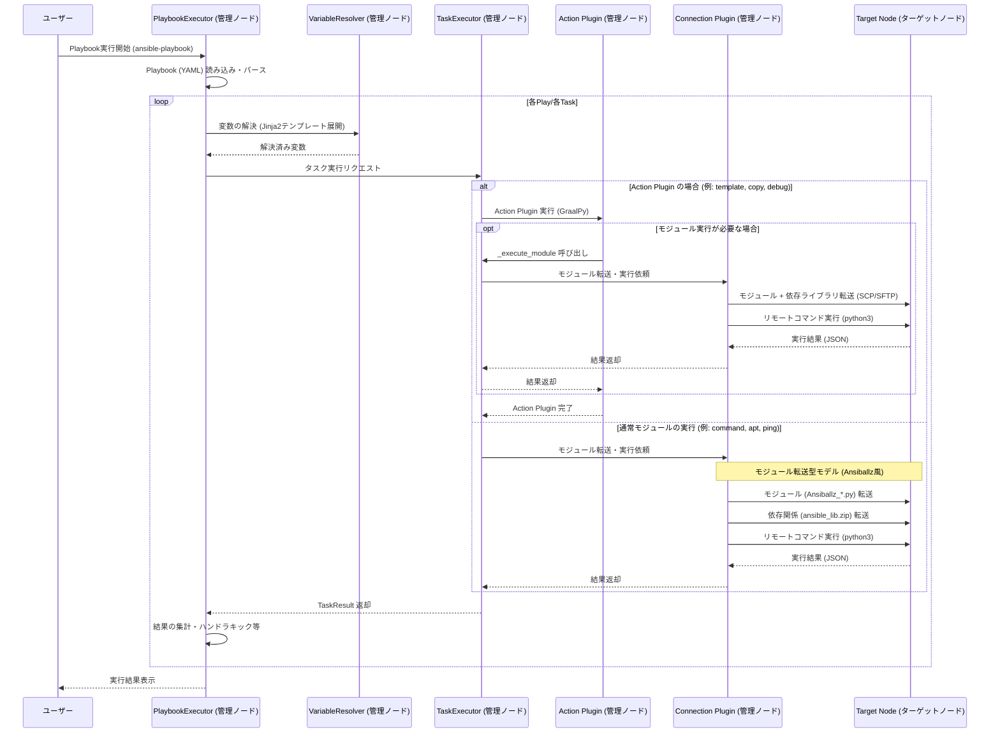

# 処理フロー：Playbook読み込みから実行まで

本ドキュメントでは、`graal-ansible` における Playbook の読み込みから、ターゲットノードでのタスク実行までの全体的な処理フローを説明します。

## 1. 全体フロー図

以下のシーケンス図は、管理ノード（制御ノード）とターゲットノードの間で行われる処理の流れを示しています。

## 2. 各コンポーネントの役割

### 管理ノード (Control Node) で実行されるもの

*   **PlaybookExecutor**: Playbook 全体の実行を管理します。Play、Block、Task の階層構造を辿り、適切な順序でタスクをスケジュールします。
*   **VariableResolver**: Jinja2 テンプレートエンジン（Jinjava）を使用して、変数の埋め込みやテンプレートの展開を行います。
*   **TaskExecutor**: 個別のタスク実行を制御します。Action Plugin なのか通常モジュールなのかを判定し、適切な実行パスを選択します。
*   **Action Plugin**: 管理ノード上で直接動作するプラグインです。複雑なロジック（ローカルファイルの読み込み、複数のモジュール実行の組み合わせ等）が必要な場合に使用されます。
*   **Connection Plugin (Local, Ssh)**: ターゲットノードとの通信を担当します。ファイルの転送（`putFile`）やコマンドの実行（`execCommand`）を抽象化します。

### ターゲットノード (Target Node) で実行されるもの

*   **Ansible Module**: 管理ノードから転送されてきた Python スクリプトです。ターゲットノード上の Python インタプリタによって実行され、実際のシステム操作（ファイル作成、パッケージインストール等）を行います。
*   **Python インタプリタ**: 転送されたモジュールを実行するためのランタイム環境です。

## 3. モジュール転送型実行モデル

`graal-ansible` は、本家 Ansible と同様に「モジュール転送型」の実行モデルを採用しています。

1.  **パッケージング**: 実行対象のモジュールと、共通ライブラリ（`ansible.module_utils` 等）を ZIP 形式にまとめます。
2.  **転送**: Connection Plugin を介して、ターゲットノードの一時ディレクトリにファイルを転送します。
3.  **実行**: ターゲットノード上の `python3` を使用して、転送したスクリプトを実行します。
4.  **回収**: 標準出力に出力された JSON 形式の結果を管理ノードで受け取ります。
5.  **クリーンアップ**: 実行後にターゲットノード上の一時ファイルを削除します。
