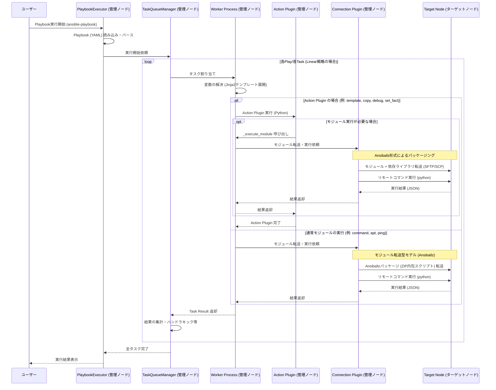

# 処理フロー：AnsibleのPlaybook読み込みから実行まで

本ドキュメントでは、本家 Ansible における Playbook の読み込みから、ターゲットノードでのタスク実行までの標準的な処理フローを説明します。

## 1. 全体フロー図

以下のシーケンス図は、管理ノード（制御ノード）とターゲットノードの間で行われる処理の流れを示しています。

## 2. 各コンポーネントの役割

### 2.1 管理ノード (Control Node) で実行されるもの

*   **PlaybookExecutor**: Playbook 全体の実行を管理します。Play、Block、Task の階層構造を辿り、実行をスケジュールします。
*   **TaskQueueManager (TQM)**: 各ホストへのタスク配信や結果の集計を制御します。
*   **Worker Process**: 個別のタスク実行を担当するプロセスです。Jinja2 を用いた変数の解決や、プラグインの呼び出しを行います。
*   **Action Plugin**: 管理ノード上で動作するプラグインです。ターゲットノードへのファイル転送の準備や、管理ノード側での複雑な処理（`template` のレンダリング等）を担当し、必要に応じてターゲットノード上でモジュールを実行させます。`graal-ansible` では、**本家 Ansible の Python 実装を GraalPy 上でそのまま動作させる「Python-first」方式**を採用しています。
*   **Connection Plugin (ssh, local, winrm等)**: ターゲットノードとの通信を担当します。ファイルの転送やリモートコマンドの実行を抽象化します。

### 2.2 ターゲットノード (Target Node) で実行されるもの

*   **Ansible Module**: 管理ノードから転送されてきた Python スクリプト（Ansiballz 形式）です。ターゲットノード上の Python インタプリタによって実行され、実際のシステム操作を行います。
*   **Python インタプリタ**: 転送されたモジュールを実行するためのランタイム環境です。ターゲット側に事前にインストールされている必要があります。

## 3. モジュール転送型実行モデル (Ansiballz)

Ansible は「エージェントレス」を実現するため、以下の手順でタスクを実行します。

1.  **パッケージング (Ansiballz)**: 実行対象のモジュール本体と、それが依存する `ansible.module_utils` などの共通ライブラリを一つの ZIP ファイルにまとめ、実行用の Python ラッパースクリプトを付加します。
2.  **一時ディレクトリの作成**: ターゲットノード上に実行用のテンポラリディレクトリを作成します。
3.  **転送**: Connection Plugin を介して、パッケージ化されたファイルをターゲットノードに転送します。
4.  **実行**: ターゲットノード上の Python を呼び出し、転送されたスクリプトを実行します。結果は標準出力に JSON 形式で出力されます。
5.  **回収とクリーンアップ**: 管理ノードが JSON 結果を読み取り、ターゲットノード上のテンポラリディレクトリを削除します。
