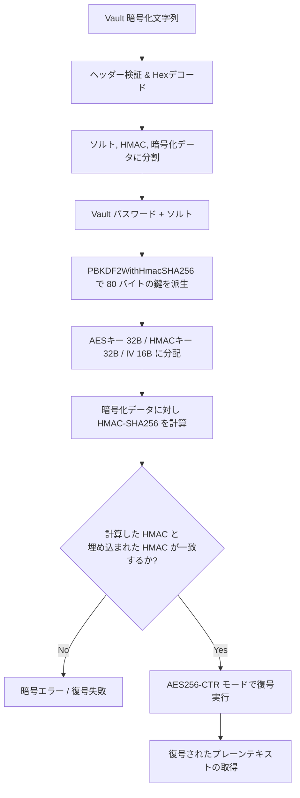

# Ansible Vault 復号サポートの設計仕様 (Ansible Vault Decryption Support)

本ドキュメントは、`graal-ansible` における Ansible Vault 暗号化データのネイティブ Java による復号サポート機能の設計・仕様について定義します。

---

## 1. 目的と背景

現在、`graal-ansible` は YAML 解析時に `!vault` タグを検知してもエラーにならず透過的にパースする仕組みを持っています。しかし、暗号化された内容自体の復号処理は実装されておらず、変数展開やタスク実行時に暗号化されたままの状態（`$ANSIBLE_VAULT;1.1;AES256...`）で扱われています。

本仕様は、管理ノード（Java 実行環境）側において、外部の Python プロセスや重厚な Ansible ライブラリに依存せず、**ネイティブ Java (JCA / javax.crypto) のみで高速かつ安全に Ansible Vault 形式のデータを復号する仕組み**を構築するための提案です。

---

## 2. Ansible Vault の暗号仕様（AES256）

Ansible Vault (フォーマットバージョン `1.1` または `1.2`) は、以下のアルゴリズムと暗号化パラメーターを使用します。

### 2.1 暗号アルゴリズムと派生キー
- **暗号化方式**: `AES256`
- **暗号モード**: `CTR` (Counter Mode)
- **パディング**: なし (`NoPadding`)
- **鍵派生関数 (KDF)**: `PBKDF2WithHmacSHA256`
- **ストレッチング回数 (Iterations)**: `10000`
- **派生鍵の総サイズ**: `80バイト (640ビット)`
  - **AES 鍵 (Cipher Key)**: 先頭の `32バイト` (256ビット)
  - **HMAC 鍵 (HMAC Key)**: 次の `32バイト` (256ビット)
  - **初期化ベクトル (IV)**: 残りの `16バイト` (128ビット)

---

## 3. 暗号データのパースと復号アルゴリズム

暗号化データは以下の構造を持ち、復号時はこの順序に従って処理を行います。

### 3.1 データの構造
Vault 暗号化されたテキスト（YAML の値など）は、以下のようなフォーマットで表されます。

```text
$ANSIBLE_VAULT;1.1;AES256
65333633393165326162646261313761356561336162386134303462663162393335353037613337
3363623936616139366461326330386162303233366364370a313038313463323530346332323863
...
```

1. **ヘッダーの検出**: `$ANSIBLE_VAULT;<version>;<algorithm>` 形式のヘッダーを確認。
2. **Hex デコード**: ヘッダー以降のテキスト行から改行文字を取り除き、十六進数文字列 (Hex) から生のバイト配列にデコードします。
3. **ペイロードの分割**: デコードされたバイト配列（ASCIIテキスト）は、以下の3つの要素が改行文字（`0x0a`）で区切られた構成になっています。
   - **ソルト (Salt)** (Hex 形式)
   - **HMAC シグネチャ** (Hex 形式)
   - **暗号化データ (Ciphertext)** (Hex 形式)

### 3.2 復号シーケンス



1. **鍵の派生 (Key Derivation)**:
   - ユーザーから提供された Vault パスワードと、上記で抽出した「ソルト」を用いて `PBKDF2WithHmacSHA256` により 80 バイトの配列を生成します。
2. **HMAC 検証 (Integrity Check)**:
   - 派生した HMAC 鍵を使用して、抽出した「暗号化データ」の HMAC-SHA256 を計算します。
   - 計算した値が、上記で抽出した「HMAC シグネチャ」と完全に一致することを確認します（タイミング攻撃対策のため、一定時間比較を行う `MessageDigest.isEqual` を使用）。
3. **AES 復号 (Decryption)**:
   - 派生した AES 鍵と IV を使用し、`AES/CTR/NoPadding` モードで「暗号化データ」を復号します。
   - 復号されたバイト配列を UTF-8 文字列に変換して返します。

---

## 4. システムアーキテクチャと統合設計

ネイティブ復号機能を `graal-ansible` に統合するため、以下のコンポーネントを設計・実装します。

### 4.1 新規インターフェースおよびクラス設計

1. **`VaultCredential` (Record)**
   - Vault パスワードの保持、またはパスワードファイルの読み込みを抽象化するレコード。
   - 複数の Vault ID (マルチパスワード) への対応も考慮します。

2. **`AnsibleVaultDecryptor` (Class)**
   - Java の標準暗号 API (`javax.crypto.Cipher`, `javax.crypto.Mac`, `javax.crypto.SecretKeyFactory`) を利用した、スレッドセーフな復号ヘルパークラス。
   - 依存ライブラリを一切増やさず、標準の JDK 21 機能のみで完結させます。

### 4.2 統合ポイント

1. **YAML パーサー (`YamlParser.java`) への統合**:
   - `!vault` タグを検出した際、パース段階で即時復号するか、遅延評価のために `VaultEncryptedValue` オブジェクトとしてマッピングします。

2. **変数解決エンジン (`VariableResolver.java`) への統合**:
   - テンプレート展開や変数評価時に、値が `VaultEncryptedValue` の場合は `VaultCredential` を用いて自動的に復号を行い、展開後の文字列を提供します。

3. **CLI インターフェース (`PlaybookCli.java`) の拡張**:
   - 本家互換の以下のオプションを追加します。
     - `--vault-password-file` / `--vault-id`: パスワードファイルから鍵を読み込む。
     - `--ask-vault-pass`: 起動時にインタラクティブにパスワードを入力させる。

---

## 5. セキュリティとパフォーマンスに関する考慮事項

1. **メモリ上の安全確保**:
   - パスワードや復号後の平文データは、ガベージコレクションされるまでメモリ上に残るリスクがあります。可能であれば、`char[]` を使用し、処理終了後に即時ゼロクリア (`Arrays.fill(pwd, '\0')`) できる構造を検討します。
2. **Native Image (GraalVM) との互換性**:
   - `javax.crypto` や KDF アルゴリズムを GraalVM Native Image でビルドする際、暗号プロバイダ (SunJCE) が静的にリンクされ、実行時に正しく解決されるように `resource-config.json` や `reflect-config.json` への登録を確認する必要があります。

---

## 6. 実装ロードマップ

本機能の実装は、以下のステップで進めることを推奨します。
詳細な設計・タスク管理は、[TODOリスト (TODO-Details.md)](../TODO-Details.md#5-今後の設計・拡張事項-future-design-and-extensions) にて追跡します。

1. **フェーズ 1 (基本アルゴリズムの実装と検証)**:
   - `AnsibleVaultDecryptor` のプロトタイプ作成と、テスト用 Vault 暗号化文字列を用いた単体テストの構築。
2. **フェーズ 2 (CLI オプションと変数解決への統合)**:
   - パスワード読み込み機能の実装、および `VariableResolver` との統合。
3. **フェーズ 3 (Native Image 最適化と動作確認)**:
   - GraalVM 環境でのビルド・動作テスト、CI での検証。
