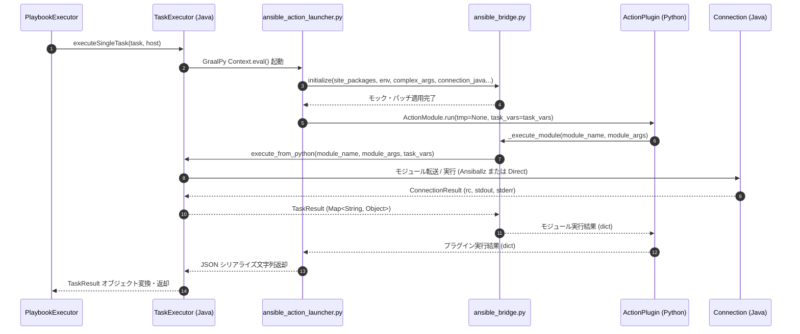

# Action Plugin 実装仕様

本ドキュメントでは、`graal-ansible` における Ansible Action Plugin の実行メカニズムの設計方針および実装詳細について詳述します。

> [!IMPORTANT]
> **基本方針**:
> `graal-ansible` では、**本家 Ansible の Python 実装（Action Plugin）をそのまま利用する「Python-first」アーキテクチャ** を採用しています。
> GraalPy 上で動作を阻害する依存関係については、`ansible_bridge.py` による **Dependency Emulation Strategy**（最小限のモック化）で対応し、プラグイン本体のロジックを改変せずに動作させることを最優先します。
>
> 以前存在した Java による Action Plugin エミュレータは、本家との完全な互換性を確保するために**原則として削除されました。** ただし、`debug` など一部のプラグインについては、移行期や特定の実行環境におけるフォールバック用として、Java による簡易実装が限定的に残されている場合があります。

## 1. Action Plugin の概要

Ansible のタスク実行には、大きく分けて以下の 2 種類があります。

1. **Module (通常モジュール)**: ターゲットノードに転送され、そこで実行される（例: `apt`, `yum`, `service`）。
2. **Action Plugin**: 管理ノード（制御ノード）上で実行され、必要に応じてターゲットノードに対して 1 回以上のモジュール実行やファイル転送を指示する（例: `template`, `copy`, `debug`, `setup`）。

`graal-ansible` では、本家 Ansible の Python 実装の Action Plugin を管理ノード側の GraalPy 上でそのまま動作させることで、100% の互換性を維持します。

## 2. 実行戦略：Python-first 方針

Worker Process (`TaskExecutor`) は、タスクの `action` 名に基づき、以下のプロセスで実行を行います。

### 2.1 Python 実装の直接実行
- `ansible-core` コレクションの `plugins/action/` 配下にある本物の Python スクリプトを、実行ブリッジ（`ansible_bridge.py` および `ansible_action_launcher.py`）を介して直接実行します。
- プラグインが依存する `ansible.plugins.action.ActionBase` などのクラスについて、**動かない（インポートエラーになる）部分のみを Java/Python で再実装・モック化**（Dependency Emulation）して提供します。
- `copy`, `template`, `debug`, `setup`, `command`, `shell`, `fetch`, `include_vars` などの主要なアクションは、すべてこの方式で動作します。

### 2.2 メリット
- **完全な互換性**: 本家 Ansible と全く同じロジックが実行されます。
- **メンテナンス性の向上**: Java 側での重複した再実装（エミュレータ）が不要になります。
- **安定性**: `ansible_bridge.py` の洗練により、重厚な `ansible-core` のロードと実行が GraalPy 上で安定して行えるようになりました。

## 3. 実行フローと Python ランチャー仕様

### 3.1 Java 側 (Worker / PythonModule)
1. **判別**: `isActionPlugin` ロジックにより Action Plugin であることを確認します。
2. **コンテキスト準備**:
   - 現在のタスク変数（`task_vars`）を Python コンテキストにバインドします。
   - Java の `ITaskExecutor` および `Connection` オブジェクトへのブリッジ（`connection_java`, `task_executor_java`）を用意します。
3. **ランチャー起動**: `ansible_action_launcher.py` を使用して、対象の Action Plugin クラスをインスタンス化し、`run()` メソッドを呼び出します。ランチャーの内部では、`ansible_bridge.py` を通じて `initialize()` が行われ、必要な全てのモックとパッチが適用されます。

### 3.2 Python 側 (ansible_action_launcher.py)
1. **Ansible コアクラスのモック**: Action Plugin が依存する `Task`, `Connection`, `PlayContext`, `DataLoader`, `Templar` 等のコアクラスを、Java ブリッジを利用するようにモック化します。
2. **プラグインのロード**: 指定された Action Plugin モジュールをインポートし、プラグインクラス（例: `ActionModule`）を生成します。
3. **実行**: プラグインの `run(task_vars)` メソッドを実行します。

### 3.3 Java-Python バインディング引数仕様
Action Plugin を実行するための `ansible_action_launcher.py` に注入される Java コンテキスト引数の一覧です。

| バインディング名 | Java 型 | 用途 |
| :--- | :--- | :--- |
| `task_vars_java` | `Map<String, Object>` | 実行コンテキストにおける変数セット（Java Map）。 |
| `module_args_java` | `Map<String, Object>` | タスクに渡されたモジュール引数マップ。 |
| `environment_java` | `Map<String, String>` | タスク固有の評価済み環境変数マップ。 |
| `site_packages_java` | `List<String>` | `ansible-core` や依存ライブラリが格納されているパスリスト。 |
| `collection_paths_java` | `List<String>` | コレクション探索パスのリスト。 |
| `connection_java` | `Connection` | ターゲットノードへのファイル転送やコマンド実行の委譲オブジェクト。 |
| `become_context_java` | `BecomeContext` | 権限昇格情報（`become=true`, `become_method`, `become_user` 等）。 |
| `action_name` | `String` | 実行対象のアクション名 (例: `copy`, `template`)。 |
| `task_executor_java` | `ITaskExecutor` | `_execute_module` 呼び出し時のタスク再帰実行ブリッジ。 |

### 3.4 実行シーケンスフロー (Sequence Flow)

以下は、Java 実行エンジンから GraalPy を経由して Action Plugin が実行され、再帰的にモジュールが呼び出される全体ライフサイクルのシーケンス図です。



## 4. GraalPy-Java ブリッジ仕様

Action Plugin の最大の特徴は、自身の内部から別のモジュールを実行できる点です。この再帰的な呼び出しを実現するため、Java 側は Python からの呼び出し専用のインターフェースを提供し、`ansible_bridge.py` 内の `ActionBase` クラスにおいてモンキーパッチを適用しています。

### 4.1 ITaskExecutor の拡張メソッド

`ITaskExecutor` は Python 側からのリクエストを受け取るため、以下のメソッドを実装・提供しています。

```java
public interface ITaskExecutor {
    /**
     * Python (Action Plugin) から呼び出され、指定されたモジュールを実行します。
     * @param moduleName モジュール名 (例: "copy", "apt")
     * @param moduleArgs モジュール引数 (Map形式)
     * @param taskVars 現在のタスク変数
     * @return 実行結果 (Map形式、Ansible互換の辞書)
     */
    Map<String, Object> execute_from_python(String moduleName, Map<String, Object> moduleArgs, Map<String, Object> taskVars);

    /**
     * 相対パスを解決し、ローカルの絶対パスを返します。
     */
    String resolveLocalPath(String relativePath);
}
```

### 4.2 ActionBase モンキーパッチの詳細仕様

`ansible_bridge.py` 内の `ActionBase` クラスでは、以下のメソッドが Java ブリッジと連携するようにモンキーパッチされています。

#### 1. `_execute_module`
Action Plugin 内部から通常モジュール（例: `setup`, `copy` のターゲットノード側処理）を呼び出します。
- **呼び出しフロー**: `task_executor_java.execute_from_python(m_name, m_args, task_vars)` を呼び出します。
- **データマッピング**: 返却された Java の `TaskResult` や `Map` オブジェクトから、`stdout`, `stderr`, `failed`, `changed` を抽出し、標準キー `module_stdout` および `module_stderr` を付与した Python 辞書に変換します。

#### 2. `_low_level_execute_command`
ターゲットノード上で低レベルなコマンドを直接実行します。
- **`chdir` サポート**: `chdir` 引数が指定された場合、`cd "<chdir>" && <cmd>` （Windows では `cd /d "<chdir>" && <cmd>`）構文のプレフィックスを自動挿入して実行します。
- **標準入力 (`in_data`)**: `in_data` が渡された場合、コネクションへデータをパイプ入力します。
- **戻り値**: `rc`, `stdout`, `stdout_lines`, `stderr`, `stderr_lines` を含む辞書を返します。

#### 3. `_transfer_file`
管理ノードからターゲットノードへのファイルアップロードを行います。
- **処理内容**: Java 側の `connection_java.putFile(Paths.get(lp), rp)` を呼び出し、ファイル転送を透過的に実行します。

#### 4. `_execute_remote_stat`
ターゲットノード上のファイル／ディレクトリ状態（存在確認、ディレクトリ判定、SHA1 チェックサム）を取得します。
- **リモート接続 (SSH)**: `connection_java.execCommand("test -d ...")` を発行し、リモートファイルの状態を取得します。
- **ローカル接続**: `os.path.exists(p)` および `hashlib.sha1` を用いて、ローカルファイルの状態を直接判定します。

#### 5. `validate_argument_spec`
Action Plugin の引数仕様（`argument_spec`）に基づいて、タスク引数の検証およびデフォルト値の補填を行います。

#### 6. `_find_needle`
管理ノード上のロールや Playbook ディレクトリからの相対パス検索（ファイル探索）を `task_executor_java.resolveLocalPath(needle)` 経由で実行し、正規化された絶対パスを返します。

### 4.3 データマッピングとシリアライズ

GraalPy の Polyglot API を介したデータ交換では、以下のルールを適用します。

- **Python -> Java**: Python の `dict` は Java の `Map<String, Object>` として、`list` は `List<Object>` として透過的にアクセス可能です。
- **Java -> Python**: Java の `Map` や `List` を Python 側へ返す際、`ansible_bridge._deep_convert` を用いて、Ansible モジュールが期待する純粋な Python オブジェクト（辞書、リスト）へ再帰的に変換します。
- **型変換**: 数値、文字列、真偽値は Polyglot 共通型として相互に自動変換されます。

### 4.4 実行コンテキストおよび `check_mode` の伝播

`execute_from_python` や `run_action_plugin` が呼び出された際、Java 側は以下の状態を維持したまま実行を行います。

1. **接続の維持**: `ActionBase` が保持している `connection_java` (SSH/Local/Docker/WinRM) をそのまま使用します。
2. **変数の同期**: `VariableManager.updateVariables` により、Python 側で変更された `task_vars` を Java 側のコンテキストへ反映させ、後続のタスクでも利用可能にします。
3. **チェックモード (check_mode) の伝播**: `ansible_check_mode` または `_ansible_check_mode` 引数から解決された真偽値が、`PlayContext.check_mode` および `mock_task.check_mode` へ自動的に反映されます。

## 5. モック化が必要なコンポーネント

Action Plugin を GraalPy 上で動作させるために、以下の Ansible 内部コンポーネントの高度なモック化が必要です。

| クラス / モジュール | モックの役割 |
| :--- | :--- |
| `ansible.plugins.action.ActionBase` | `_execute_module`, `_low_level_execute_command` 等を Java ブリッジへルーティング。 |
| `ansible.playbook.task.Task` | タスク情報、変数、タグ等のプロパティを提供。 |
| `ansible.executor.playbook_executor` | 実行コンテキストのシミュレーション。 |
| `ansible.template.Templar` | 制御ノード側でのテンプレートレンダリング機能（Java 側の `VariableResolver` と連携）。 |

## 6. 依存関係エミュレーション戦略 (Dependency Emulation Strategy)

GraalPy 上での実行において、Ansible Core の重厚な依存関係がボトルネックとなる場合があります。特に C 拡張を含むモジュールは `ApiInitException` などの原因となるため、以下の戦略で回避します。

### 6.1 強制的なモック化
`ansible_bridge.py` において、以下のモジュールを強制的に `None` またはスタブに置き換えることで、ロード時のクラッシュを防ぎます。
- `cryptography`, `cffi`: ネイティブライブラリのロード失敗を回避。
- `yaml._yaml`: C 拡張版の YAML ローダーを無効化（Pure Python 版を使用）。
- `markupsafe._speedups`: Jinja2 関連の C 拡張を回避。

### 6.2 OS 依存モジュールのエミュレーション
Windows 管理ノード対応などのため、Linux 固有のモジュール（`grp`, `pwd`, `syslog`, `termios`）を Python の `types.ModuleType` を用いて動的にエミュレートし、インポートエラーを抑制します。

## 7. 実装済みの Action Plugin

主要なアクションプラグインは、すべて **Python (Actual)** 方式、すなわち本家 Ansible のソースコードをそのまま実行する方式で検証されています。

| プラグイン名 | 実装方式 | 備考 |
| :--- | :--- | :--- |
| `debug` | Python (Actual) | 変数の表示。 |
| `set_fact` | Python (Actual) | 変数の動的登録。 |
| `copy` | Python (Actual) | `ansible_bridge.py` による `ActionBase` の高度なモックにより動作。 |
| `template` | Python (Actual) | 管理ノード側での Jinja2 レンダリングを含む。 |
| `setup` | Python (Actual) | ファクト収集。 |
| `fetch` | Python (Actual) | ターゲットノードからのファイル取得。 |
| `include_vars` | Python (Actual) | 動的な変数ファイルの読み込み。 |
| その他 | Python (Actual) | `ansible_bridge.py` 経由での実行。 |

## 8. Java によるエミュレータの廃止

> [!IMPORTANT]
> **本プロジェクトでは、以前存在した Java ベースの Action Plugin エミュレータは、Python-first 方針への移行に伴いすべて削除・置換されました。**

以前は `set_fact`, `copy`, `template`, `debug` などの主要なアクションを Java で再実装していましたが、現在はオリジナルの Python ソースコード実行に完全に一本化されています。これにより、Ansible 本家との 100% の互換性とメンテナンス性の向上を実現しています。

## 9. 関連ドキュメント
- [GraalPy 互換性テクニカルリファレンス](Action-Plugins-Investigation.md)
- [GraalPy 統合の詳細](../tech/GraalPy-Integration.md)
- [タスク実行エンジン](Task-Executor.md)
- [リモートノードでのモジュール実行仕様](Remote-Module-Execution.md)
- [Ansible モジュールの初期化と設定](Ansible-Module-Initialization.md)

---

## 10. 新規アクションプラグインのサポート追加ガイド

新しい Ansible コレクションのアクションプラグインを `graal-ansible` でサポートするための標準的なワークフローです。

### 10.1 ステップ 1: ロード確認
1. 対象のアクションを含む Playbook を作成し、実行します。
2. GraalPy 上でのインポート時に `ApiInitException` や `ModuleNotFoundError` が発生するか確認します。

### 10.2 ステップ 2: 依存関係の解決 (Dependency Emulation Strategy)
ロードに失敗する場合、`ansible_bridge.py` を修正します。

- **ネイティブ拡張の回避**: C 拡張を含むモジュール（例: `cryptography`）は、`sys.modules['mname'] = None` としてロードをスキップさせます。
- **不足モジュールのスタブ化**: POSIX 固有のモジュールが Windows 環境で不足している場合、`types.ModuleType` を用いて最小限の属性を持つスタブを登録します。
- **パス正規化**: パス操作で `OSError` が発生する場合、`_normalize_path` を適用するモンキーパッチを追加します。詳細は [Mock 実装リファレンス](Mock-Implementation-Reference.md) を参照してください。

### 10.3 ステップ 3: ActionBase モックの拡張
アクションプラグインが `ActionBase` 未実装メソッド（例: `_execute_remote_stat`, `_transfer_file`）に依存している場合、`ansible_bridge.py` 内の `ProxyActionBase` クラスに Java ブリッジを介した実装を追加します。

### 10.4 ステップ 4: 統合テストの追加
`ActualModuleIntegrationTest.java` に新しいテストケースを追加し、実際のコンテナ環境（Linux）でアクションが期待通りに動作することを確認します。
