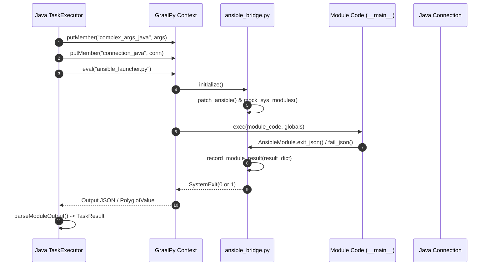

# Ansible モジュールの初期化と設定

本ドキュメントでは、`graal-ansible` が Ansible の Python モジュールを実行する際、どのように引数を渡し、`AnsibleModule` インスタンスを構成しているかについて詳述します。

## 1. 概要

Ansible モジュールは通常、標準入力経由で引数（JSON または key=value 形式）を受け取りますが、`graal-ansible` では GraalPy の Polyglot API を利用して、Java 側から Python コンテキストへ直接データを注入します。これにより、外部プロセスの起動オーバーヘッドを削減し、Java 側の接続オブジェクトなどを Python 側から直接利用することを可能にしています。

## 2. Java から Python へのデータ受け渡し

`PythonModule.java` において、以下のデータが GraalVM Context の bindings にセットされます。

| 変数名 | 型 (Java) | 説明 |
| :--- | :--- | :--- |
| `complex_args_java` | `Map<String, Object>` | モジュールに渡される引数。 |
| `module_name` | `String` | 実行対象のモジュール名（例: `ping`, `copy`）。 |
| `site_packages_java` | `List<String>` | `ansible-core` 等がインストールされているパス。 |
| `connection_java` | `Connection` | 現在のターゲットへの接続オブジェクト。 |
| `become_context_java`| `BecomeContext` | 権限昇格の設定。 |

## 3. 初期化フローと `ansible_bridge.py`

`graal-ansible` では、効率化のために `TaskExecutor` のコンストラクタ内で `ansible_bridge.py` をあらかじめロード（事前ロード）しています。このブリッジスクリプトは、GraalPy 環境における共通の初期化ロジック、モジュールモック、および Ansible へのパッチ提供を一手に担います。

各ランチャー（`ansible_launcher.py`, `ansible_action_launcher.py`, `ansible_mock_launcher.py`）は、実行の冒頭でこのブリッジ内の `initialize()` 関数を呼び出すことで、タスク固有の変数（`complex_args` 等）のバインドと実行環境の最終的なセットアップを行います。

### 3.1 ブリッジが提供する主要機能
- **`setup_sys_path(site_packages)`**: `site_packages_java` を `sys.path` に追加し、Ansible ライブラリをロード可能にします。
- **`setup_env(env_vars)`**: Java 側から渡された環境変数を `os.environ` に注入します。
- **`mock_problematic_modules()`**: `cryptography`, `selinux` などのネイティブ依存モジュールのモック化、および `grp`, `pwd`, `termios`, `syslog` などのシステムモジュールのスタブ化を行います。
- **`patch_ansible(...)`**: `AnsibleModule` の `run_command` や `_load_params` をパッチし、Java 側の `Connection` オブジェクトを介した実行を可能にします。
- **`execute_module(...)`**: `__main__` スコープの設定を行い、モジュールコードを安全に実行します。

## 4. グローバルスコープ (`__main__`) への属性注入

Ansible の一部のモジュール（`apt`, `package_facts` など）は、メタデータや引数を取得するために自分自身（`__main__`）をインポートしたり、特定のグローバル変数が存在することを期待したりします。

`ansible_launcher.py` では、モジュールの実行直前に `sys.modules['__main__']` に対して以下の属性を注入します。

| 属性名 | 説明 |
| :--- | :--- |
| `_module_fqn` | モジュールの完全修飾名（例: `ansible.builtin.ping`）。 |
| `complex_args` | 変換済みの引数辞書。 |
| `_modlib_path` | モジュールライブラリのパス（本プロジェクトでは原則 `None`）。 |

また、`exec()` を用いてモジュールコードを実行する際、以下の設定を行っています。

- **`__name__` の設定**: グローバル辞書の `__name__` を `'__main__'` に設定することで、多くのモジュールに含まれる `if __name__ == '__main__':` ブロックが正しく実行されるようにしています。
- **`module` インスタンスの参照**:
    - 通常、Ansible モジュール内では `module = AnsibleModule(...)` のようにインスタンス化が行われます。
    - この `module` 変数は通常 `main()` 関数などのローカル変数ですが、一部の共通コード（特に古いモジュールや特定の `module_utils`）は `from __main__ import module` のようにグローバルな `module` インスタンスを直接参照しようとします。
    - `ansible_launcher.py` は `__main__` モジュールとして動作しているため、モジュールがグローバルスコープで `module` を定義（または `main` 内で `global module` を使用）すると、それが `sys.modules['__main__']` の属性として保持され、他のユーティリティから参照可能になります。
- **グローバル環境の構築**:
    - `ansible_launcher.py` は、モジュールコードを `exec()` で実行する際、第2引数（globals）として渡す辞書を慎重に制御します。
    - この辞書には `__name__: '__main__'` が設定されており、実行されるモジュールコードにとってはこの辞書自体がグローバルスコープ（`__main__` の `__dict__`）として機能します。
- **インスタンスの生存期間**:
    - `exec()` 内で `AnsibleModule` が作成されると、そのインスタンスはモジュールの実行コンテキスト内で保持されます。
    - インスタンス化の過程で、モンキーパッチされた `_load_params` や `run_command` が呼び出され、Java 側から渡された引数や接続設定がインスタンスに統合されます。

## 5. `AnsibleModule` へのモンキーパッチ

Ansible モジュールの基盤となる `AnsibleModule` クラスに対して、以下のパッチを適用しています。

### 5.1 引数のロード (`_load_params`)
通常は標準入力から読み取る引数を、Java から渡された `complex_args` を直接使用するように変更します。
```python
ansible.module_utils.basic.AnsibleModule._load_params = lambda self: (complex_args, 'main')
```

### 5.2 コマンド実行 (`run_command`)
モジュール内でのコマンド実行を、Java 側の `Connection` オブジェクトを経由するように変更します。これにより、SSH 経由の実行などが透過的に行われます。
また、`ansible_bridge.py` 内の `mock_run_command` は、`getent` コマンドの出力をエミュレートする機能を備えており、Linux 以外の環境でもユーザー/グループ情報の取得を可能にしています。

### 5.3 バイナリパスの検索 (`get_bin_path`)
システム探索を避け、パフォーマンスと安全性のために `/usr/bin/` 以下のパスを優先的に返すように固定します。

### 5.4 結果の記録 (`_record_module_result`)
モジュールの実行結果（辞書型）を JSON シリアライズし、Java 側がキャプチャ可能な形式で出力（標準出力または内部変数への代入）します。

## 6. システムモジュールのモック

GraalPy の制限や、Ansible 内部の複雑な依存関係を回避するため、以下のモジュールをモックに差し替えています。

-   **`ansible.utils.display`**: `Display` クラスをスタブ化し、不必要な依存関係や表示処理を抑制します。
-   **`grp`, `pwd`**: POSIX ユーザー/グループ情報を返すスタブを `sys.modules` に注入します。
-   **`termios`**: 端末制御関連の定数とメソッドをスタブ化します。
-   **`cryptography`, `selinux`**: ネイティブ依存が強い、あるいは不要なモジュールを `None` に設定し、インポートエラーを制御します。

## 7. チェックモードの制御

チェックモード（ドライラン）の動作は、Playbook レベルおよびタスクレベルの設定に基づき、`PlaybookExecutor` によって決定されます。

-   **フラグの注入**: チェックモードが有効な場合、`_ansible_check_mode: true` という引数が `complex_args` に注入されます。
-   **モジュールの動作**: `AnsibleModule` インスタンスは、自身に渡された `_ansible_check_mode` 引数を参照し、実際の変更を伴う処理をスキップするかどうかを判断します（これは Ansible 本来の動作と同じです）。
-   **一貫性の維持**: Java 側でチェックモードの判定（テンプレート評価等）を完結させ、Python 側には最終的な真偽値のみを渡すことで、複雑な条件分岐の二重実装を防いでいます。

## 8. Polyglot 実行ライフサイクルのシーケンス構造 (Execution Flow)

Java `TaskExecutor` から GraalPy `Polyglot Context`、`ansible_bridge.py`、およびモジュール実行コードに至る一連の呼び出し・応答シーケンス構造です。



## 9. Python ブリッジの例外・終了コード制御仕様 (`SystemExit` / `parseModuleOutput`)

Python モジュールの実行終了および例外発生時のキャプチャ・レスポンス解析仕様です。

- **`SystemExit` の捕捉と終了コード解析**:
  - Python モジュールは処理完了時に `AnsibleModule.exit_json()` または `fail_json()` を呼び出し、内部で `sys.exit(0)` または `sys.exit(1)` (例外 `SystemExit`) を発起します。
  - `ansible_bridge.py` 内の `execute_module()` は `try...except SystemExit` ブロックでこれを捉え、正常終了コード `0` の場合は `_record_module_result` でシリアライズされた JSON 辞書を標準出力/戻り値として保持します。
  - `SystemExit(1)` または非ゼロ終了コードの場合は、`failed: true` フラグをセットした結果辞書を構築します。
- **未補足例外 (Unhandled Exception) の構造化変換**:
  - Python ランタイム上で未補足の `Exception` や `ImportError` が発生した場合、Python ブリッジはスタックトレース文字列を抽出・整形し、`{"failed": true, "msg": traceback_str, "exception": traceback_str}` 形式の JSON オブジェクトへ自動変換します。
- **Java 側 `parseModuleOutput` による復元**:
  - Java 側の `TaskExecutor.parseModuleOutput` は、返却された JSON 文字列を Jackson `ObjectMapper` により `Map<String, Object>` へデコードし、`TaskResult` インスタンスへ格納します。
  - JSON パースに失敗した場合は、生テキスト出力を `msg` フィールドに保持したフォールバック `TaskResult.failure(rawOutput)` オブジェクトを安全に作成します。

## 10. マルチスレッド並列実行時 (`FreeStrategy`) のコンテキスト隔離とクリーンアップ

`FreeStrategy` やマルチスレッド環境において、単一の GraalPy Context またはスレッド間での状態汚染（State Pollution）を防止するための分離仕様です。

- **スレッドローカル探索パス・コンテキスト管理**:
  - `TaskExecutor` は、スレッドごとのコレクション検索パスを ThreadLocal 変数（`setCurrentCollectionPaths`）として分離管理します。
- **`sys.modules['__main__']` の各タスク前後の初期化**:
  - 各タスク実行直前に `sys.modules['__main__']` の属性（`complex_args`, `module`, `_module_fqn`）をクリア・上書きバインドします。
- **Polyglot Bindings の明示的クリーンアップ**:
  - タスク実行完了（`finally` ブロック）時に、`context.getBindings("python").removeMember(...)` を呼び出し、前タスクの `complex_args_java` や `connection_java` オブジェクト参照を破棄してメモリリークおよび誤参照を防止します。

## 11. Action Plugin ランチャー連携仕様 (`ansible_action_launcher.py`)

制御ノード（管理ノード）側で動作する Action Plugin を GraalPy 上で実行するためのバインディング引数マトリクスおよびメソッドエミュレーション仕様です。

- **Java-Python バインディング引数マトリクス**:

| 変数名 | Java 型 | 説明 |
| :--- | :--- | :--- |
| `task_vars_java` | `Map<String, Object>` | タスクレベルで評価済みの全変数マップ。 |
| `connection_java` | `Connection` | ターゲット接続オブジェクト（`execCommand`, `putFile`, `fetchFile`）。 |
| `task_executor_java` | `ITaskExecutor` | Action Plugin 内からの低レベルモジュール呼び出し（`_execute_module`）用プロキシ。 |
| `task_args_java` | `Map<String, Object>` | Action Plugin に渡されたタスク引数（`args`）。 |
| `play_context_java` | `PlayContext` / `BecomeContext` | チェックモード、権限昇格情報等の実行コンテキスト。 |

- **`ActionBase` のメソッド・モンキーパッチ仕様**:
  - Python 側の `ansible.plugins.action.ActionBase` に対して以下のパッチを適用し、Java 側のインフラを直接呼び出せるよう構成します。
    - **`_execute_module(...)`**: `task_executor_java.executeModuleFromAction(...)` へ委譲し、ターゲットノードでのモジュール実行結果を Python 辞書として返却。
    - **`_low_level_execute_command(...)`**: `connection_java.execCommand(...)` へ委譲し、シェルコマンド実行結果（rc, stdout, stderr）を返却。
    - **`_transfer_file(...)`**: `connection_java.putFile(...)` へ委譲し、ローカルファイルをリモート一時パスへ転送。

## 12. 関連ドキュメント
- [タスク実行エンジン](Task-Executor.md)
- [タスク制御の実装詳細](Task-Control.md)
- [Action Plugin 実装仕様](Action-Plugins.md)
- [GraalPy 統合の詳細](../tech/GraalPy-Integration.md)
