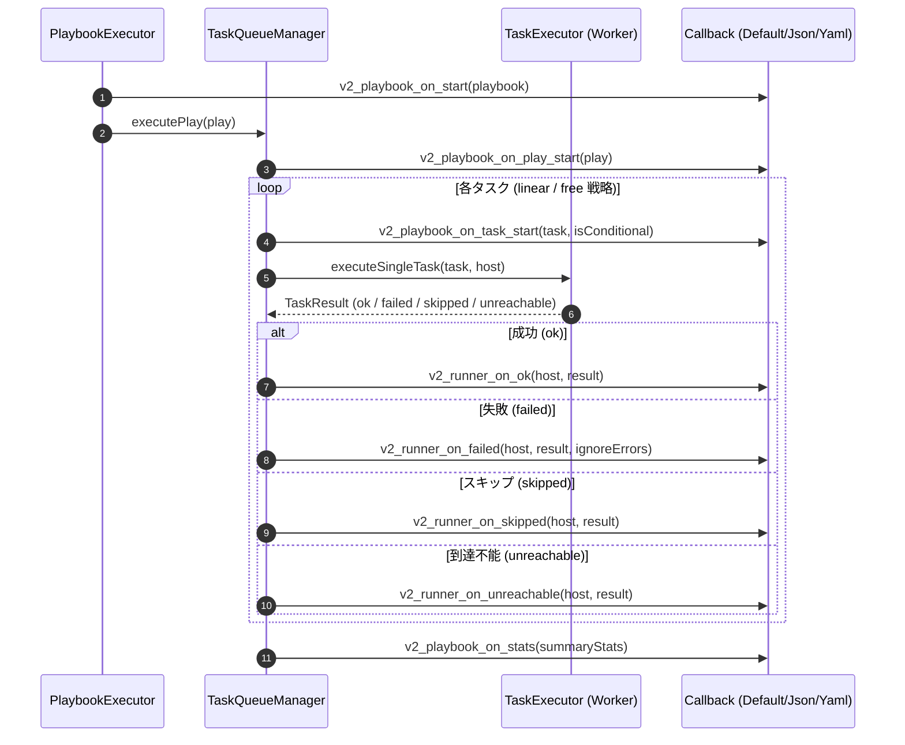

# コールバックプラグインの設計仕様 (Callback Plugins Implementation)

本ドキュメントでは、`graal-ansible` における実行結果の出力とイベント通知を制御する「コールバックプラグイン」の設計方針、コンポーネント構成、データマッピング、イベントライフサイクル、および実装詳細について詳述します。

## 1. 概要

コールバックプラグインは、Playbook 実行中の各ライフサイクルイベント（Playbook の開始、Play の開始、タスクの実行、イテレーション完了、成功/失敗/到達不能等）をフックし、標準出力へのログ表示や外部システムへの通知、構造化レポートの生成などを行うための仕組みです。現在、`graal-ansible` では Java ネイティブなコールバックシステムおよび Python ベースのコールバック連携が完全に実装されています。

## 2. インターフェース定義

Java で実装されるすべてのコールバックプラグインは、以下の `Callback` インターフェースを実装します。メソッド名は Ansible 本家の Callback 互換（v2 API）を完全に踏襲しています。

```java
public interface Callback {
    /** Playbook 実行開始時 */
    void v2_playbook_on_start(Playbook playbook);

    /** Play 実行開始時 */
    void v2_playbook_on_play_start(Play play);

    /** タスク実行開始時 */
    void v2_playbook_on_task_start(Task task, boolean isConditional);

    /** タスク成功時 (ok) */
    void v2_runner_on_ok(String host, TaskResult result);

    /** タスク失敗時 (failed) */
    void v2_runner_on_failed(String host, TaskResult result, boolean ignoreErrors);

    /** タスクスキップ時 (skipped) */
    void v2_runner_on_skipped(String host, TaskResult result);

    /** ホスト到達不能時 (unreachable) */
    void v2_runner_on_unreachable(String host, TaskResult result);

    /** ハンドラー実行開始時 */
    void v2_playbook_on_handler_stats(String handlerName);

    /** 最終統計情報の出力時 */
    void v2_playbook_on_stats(Map<String, Map<String, Integer>> stats);
}
```

## 3. 実行エンジンへの統合

### 3.1 登録メカニズム
- `TaskQueueManager` は、有効化された `Callback` インスタンスのリスト（`List<Callback>`）を保持します。
- デフォルトでは、標準出力を行う `DefaultCallback` が登録されます。
- `CallbackFactory` を介して、環境変数や設定ファイルに基づく動的なコールバックプラグインの選択が可能です。

### 3.2 イベントのトリガー
- `PlaybookExecutor` および `TaskQueueManager` 内の各ライフサイクルイベント発生時に、登録されたすべてのコールバックの該当メソッドを順次呼び出します。
- **Linear 戦略との兼ね合い**: Linear 戦略では、1つのタスクが全ホストで完了するのを待つため、各ホストの結果が返却される都度 `v2_runner_on_ok` 等が呼び出されます。
- **Free 戦略との兼ね合い**: Free 戦略では、各ホストが独立してタスクを順次実行するため、複数スレッドから非同期にコールバックメソッドが呼び出されます。

### 3.3 コールバック解決優先順位 (Resolution Precedence)

実行時に使用されるメインの `stdout` コールバックプラグイン（標準出力プラグイン）は、以下の優先順位（1 が最優先）に従って決定・インスタンス化されます。

1. **環境変数 `ANSIBLE_STDOUT_CALLBACK`**: （例: `ANSIBLE_STDOUT_CALLBACK=json` や `ANSIBLE_STDOUT_CALLBACK=minimal`）
2. **`ansible.cfg` 設定ファイル**: `[defaults]` セクション配下の `stdout_callback` 設定項目。
3. **デフォルトフォールバック**: `default` (`DefaultCallback`)。

### 3.4 イベント伝播シーケンスフロー (Sequence Flow)

以下は、`PlaybookExecutor` および `TaskQueueManager` から各コールバックプラグインへライフサイクルイベントが通知される全体シーケンス図です。



### 3.5 非ブロッキングエラーハンドリングと例外の分離

コールバックプラグイン内部で例外（`RuntimeException` や I/O 例外等）が発生した場合でも、Playbook の本体処理やターゲットノードでのタスク実行が中断・阻害されることを防ぐため、以下の分離機構が組み込まれています。

- **例外キャッチと隔離**: `TaskQueueManager` がコールバックメソッド（`v2_runner_on_ok` 等）を呼び出す際、個々のコールバック呼び出しを `try-catch (Throwable t)` ブロックで保護します。
- **エラー出力**: コールバックプラグイン内部でスローされた例外はデバッグログ（`LOGGER.log(Level.SEVERE, ...)`）にのみ記録され、他ホストのタスク処理や Playbook の実行状態には影響を及ぼしません。

## 4. 標準コールバック (DefaultCallback)

Ansible 本家のデフォルト出力形式に近い人間視認性の高いログをコンソール出力します。

- **`PLAY [name]`**: Play の開始ヘッダー出力。
- **`TASK [name]`**: タスクの開始ヘッダー出力。
- **ループ結果の表示**:
    - `loop` を含むタスクの実行時、イテレーションごとの結果を表示します。
    - アイテムのラベルとして、実行結果に含まれる `_ansible_item_label` フィールド（または `item` フィールド）を使用し、複雑なデータ構造のループ時にも簡潔な出力を提供します。
- **`ok: [host]`**, **`changed: [host]`**, **`fatal: [host]`**: 各ホストの実行結果ステータス。
- **`PLAY RECAP`**: 最終的な成功・変更・失敗・到達不能・スキップ数の統計サマリーテーブル。

## 5. 実装済みのプラグイン

`graal-ansible` に標準搭載されている 4 種類の主要コールバックプラグイン、およびデータのマッピング規則です。

### 5.1 DefaultCallback
Ansible 標準の対話型コンソール出力形式を提供します。詳細度は `-v`, `-vvv` 等のフラグに応じて自動制御されます。

### 5.2 JsonCallback
実行結果を構造化された 1 つの JSON 文字列としてシリアライズ出力します。

- **有効化方法**: 環境変数 `ANSIBLE_STDOUT_CALLBACK=json` を設定して実行します。
- **出力構造**:
  ```json
  {
    "plays": [
      {
        "play": { "name": "Webserver Setup", "id": "uuid" },
        "tasks": [
          {
            "task": { "name": "Install nginx" },
            "hosts": {
              "web01": {
                "changed": true,
                "rc": 0,
                "stdout": "Loaded plugins...",
                "stdout_lines": ["Loaded plugins..."]
              }
            }
          }
        ]
      }
    ],
    "stats": {
      "web01": { "ok": 5, "changed": 2, "unreachable": 0, "failures": 0, "skipped": 1 }
    }
  }
  ```

### 5.3 MinimalCallback
ホストごとの実行結果を最小限のワンライン（1行）形式でシンプルに出力するプラグインです。CI/CD パイプラインや大規模ログ収集環境に適しています。

- **有効化方法**: 環境変数 `ANSIBLE_STDOUT_CALLBACK=minimal` を設定して実行します。
- **出力形式仕様**:
  - **成功 (ok)**: `host | SUCCESS => { "changed": false, "rc": 0 }`
  - **変更 (changed)**: `host | CHANGED => { "changed": true, "rc": 0, "stdout": "..." }`
  - **失敗 (failed)**: `host | FAILED! => { "changed": false, "rc": 1, "msg": "..." }`
  - **スキップ (skipped)**: `host | SKIPPED`
  - **到達不能 (unreachable)**: `host | UNREACHABLE! => { "msg": "Could not connect..." }`

### 5.4 YamlCallback
タスクごとの実行結果データ（標準出力、環境変数、戻り値辞書等）を整形された構造化 YAML 形式で視認性高く出力するプラグインです。

- **有効化方法**: 環境変数 `ANSIBLE_STDOUT_CALLBACK=yaml` を設定して実行します。
- **出力形式仕様**:
  - `DefaultCallback` のタスクヘッダー表示形式を継承しつつ、タスクの実行結果データ部（`TaskResult.getData()`）を SnakeYAML の pretty-yaml スタイル（インデント 2 スペース、キーソート）で描画します。
  - 改行を含む `stdout` / `stderr` は、YAML のブロックインジケータ（`|`）形式として透過的に読みやすく整形されます。

### 5.5 コールバック間における TaskResult フィールドマッピング規則

`TaskResult` オブジェクトが各コールバックプラグインへ渡された際、共通フィールドがどのように構造化・表示されるかのデータマッピング仕様です。

| TaskResult フィールド | データ型 | DefaultCallback | JsonCallback | MinimalCallback | YamlCallback |
| :--- | :--- | :--- | :--- | :--- | :--- |
| `rc` | `Integer` | 失敗時のみ表示 | `hosts[h].rc` | `rc: 0` | `rc: 0` (YAML) |
| `stdout` | `String` | `-v` 以上で表示 | `hosts[h].stdout` | JSON 内出力 | ブロックテキスト (`\|`) |
| `stderr` | `String` | 失敗時または `-v` | `hosts[h].stderr` | JSON 内出力 | ブロックテキスト (`\|`) |
| `msg` | `String` | メッセージ表示 | `hosts[h].msg` | `msg: "..."` | `msg: "..."` |
| `changed` | `boolean` | `changed: [host]` | `hosts[h].changed` | `CHANGED` ヘッダー | `changed: true` |
| `failed` | `boolean` | `fatal: [host]` | `hosts[h].failed` | `FAILED!` ヘッダー | `failed: true` |
| `results` (loop) | `List<Map>` | イテレーション表示 | `hosts[h].results` | JSON 内リスト | YAML リスト構造 |

## 6. 今後の拡張性

今後の設計・拡張事項については、[検討事項・TODOリスト](../TODO-Details.md#5-今後の設計・拡張事項-future-design-and-extensions) を参照してください。

## 7. 並列実行における出力の最適化 (Implemented) {#7-並列実行における出力の最適化}

`free` 戦略などの並列実行環境において、複数のホストが同時に同じタスクを実行する際、標準出力が混み合ったり、同じタスクヘッダーが何度も出力されたりする問題を解決するための実装です。

### 7.1 タスクヘッダーの重複排除 (Deduplication)
- **概要**: 同一タスクに対するヘッダー出力を 1 回のみに制限します。
- **実装**:
    - `DefaultCallback` 内で、`ConcurrentHashMap.newKeySet()` を使用して出力済みのタスク/ハンドラーを追跡します。
    - ヘッダー出力前にセットを確認し、未出力の場合のみ出力します。
    - `v2_playbook_on_play_start` でセットをクリアし、プレイごとの重複排除を実現しています。

### 7.2 スレッドセーフなコンソール出力
- **概要**: 複数のスレッドからの出力がインターリーブしないことを保証します。
- **実装**:
    - `DefaultCallback` の各公開メソッドに `synchronized` を付与し、1 つのライフサイクルイベントに対する複数行の出力がアトミックに行われるように保証しています。

## 8. ロギング方針との関係
- `Logging-Policy.md` で定義される `java.util.logging` は、主に内部デバッグやシステムエラー用です。
- ユーザー向けの「実行結果レポート」は、本コールバックシステムが主導します。

## 9. Python ベースのコールバックのサポート (Implemented) {#9-python-ベースのコールバックのサポート}

GraalPy を活用し、Ansible 本家の Python 製コールバックプラグインをそのまま実行可能にするための実装詳細です。

### 9.1 ブリッジメカニズム
- `ActionPlugin` と同様のブリッジメカニズム（`ansible_bridge.py`）を利用して、Python 側の実行環境を構成します。
- `ansible.plugins.callback` パッケージから指定されたプラグインを動的にロードします。

### 9.2 イベントのマッピング
Java 側の `Callback` インターフェースの各メソッド呼び出しを、Python 側のプラグインが持つ対応するメソッド（v2 API）へ転送します。

| Java (Callback interface) | Python (CallbackBase method) |
| :--- | :--- |
| `v2_playbook_on_start` | `v2_playbook_on_start` |
| `v2_playbook_on_play_start` | `v2_playbook_on_play_start` |
| `v2_runner_on_ok` | `v2_runner_on_ok` |
| `v2_runner_on_failed` | `v2_runner_on_failed` |
| `v2_runner_on_skipped` | `v2_runner_on_skipped` |
| `v2_runner_on_unreachable` | `v2_runner_on_unreachable` |
| `v2_playbook_on_handler_stats` | `v2_playbook_on_handler_stats` |
| `v2_playbook_on_stats` | `v2_playbook_on_stats` |

### 9.3 データ変換と Polyglot 連携
- Java 側の `TaskResult`, `Play`, `Task` などのオブジェクトを、Python 側が扱いやすい形式（辞書または Polyglot Proxy）に変換して渡します。
- Python 側での標準出力（`print` 等）は、Java 側の出力ストリームに適切にリダイレクトされます。
