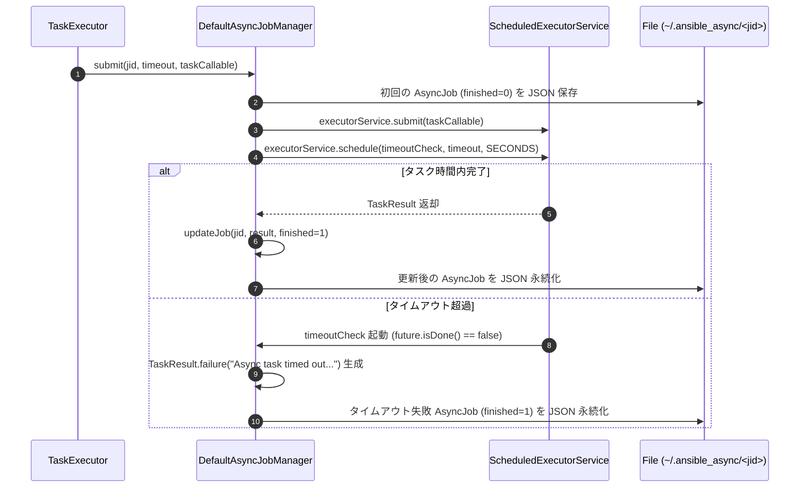

# タスク実行エンジン (Worker Process)

タスク実行エンジン（`TaskExecutor`）は、Ansible の **Worker Process** に相当し、Playbook 内の個別のタスクを解釈・実行して結果を収集する責務を持ちます。

## 1. 実行フロー

`TaskExecutor` は、`PlaybookExecutor` から依頼された特定のホストに対するタスク実行ユニットを処理します。全体図は [処理フロー (Process-Flow.md)](../features/Process-Flow.md) を参照してください。

1. **変数の集約**: `VariableManager` を通じて、Play, Host, Task 各レベルの変数を集約します。
2. **ループの展開**: `loop` フィールドを評価し、アイテムごとのイテレーションを開始します。
3. **引数のテンプレート展開**: 各イテレーションにおいて、`VariableResolver` を用いて、モジュール引数（`args`）に含まれる Jinja2 テンプレートを評価します。
4. **実行条件の評価**: `when` 句を評価し、タスクを実行すべきか判断します。
5. **Action Plugin 判定**: 実行対象が Action Plugin か通常 Module かを判定します。
6. **Action Plugin の実行 (管理ノード)**: Action Plugin の場合、管理ノードの GraalPy 上で実行します。ファイル転送が必要な場合などは、内部から `Connection` を介して操作を行います。
7. **モジュール実行 (ターゲットノード)**: 通常モジュール、または Action Plugin からの指示がある場合、Ansiballz パッケージを作成し、`Connection` プラグインを介してターゲットノードで実行します。
8. **結果の解析と変換**: 実行結果（JSON）を `TaskResult` オブジェクトに変換し、`TaskQueueManager` へ返却します。

## 2. 実行戦略 (Strategy)
初期実装では、Ansible のデフォルトである `linear` 戦略を採用しています。
- **Linear 戦略**: 1つのタスクが全ターゲットホストで完了（または失敗）してから、次のタスクに進みます。
- **失敗ホストの追跡**: あるタスクで失敗したホストは、同じ Play 内の以降のタスク実行から除外されます。

## 3. 実行結果の解析 (TaskResult)
モジュールからの戻り値を `TaskResult` オブジェクトにマッピングします。
- **成功判定**: `failed` フラグが `false`（または未定義）の場合に成功とみなします。
- **変更の検知**: 戻り値の `changed` フィールドが `true` の場合、システムの変更があったと判断します。`TaskResult.success(Map<String, Object> data)` メソッドにより、安全に `changed` ステータスを抽出します。

## 4. Pythonモジュールの実行 (GraalPy)
既存のAnsible Pythonモジュールとの互換性を維持するため、GraalVM上のPythonランタイムである **GraalPy** を利用します。

- **統合方法**: Javaコード内から GraalVM SDK の Polyglot API を介して Python スクリプトを直接呼び出します。
- **メリット**: 
    - 外部の Python インタプリタのインストールが不要。
    - Java オブジェクトと Python オブジェクト間での高速なデータ交換。
    - Native Image に Python ランタイムを内包可能。

## 5. 並列実行とスレッドセーフティ

`free` 戦略や `forks` 設定によるマルチホスト並列実行において、`TaskExecutor` は以下の仕組みで実行コンテキストの一貫性と安全性を確保しています。

- **コレクションパスの管理**:
    - `TaskExecutor` は `ThreadLocal` を使用して、スレッドごとに独立したコレクション探索パスを保持します。
    - これにより、並列実行されるタスク間で、コレクションの解決コンテキストが混ざることを防ぎます。
- **コネクションの隔離**:
    - 非同期タスク (`async`) の実行時には、バックグラウンドでの安定性を確保するため、そのタスク専用の `Connection` インスタンスを新規に生成して実行します。
- **変数の分離**:
    - 各タスクの実行前に、そのホスト固有の変数セットを `VariableManager` から取得し、スレッド固有のスタック上でテンプレート展開を行います。

## 6. ループタスクの展開と実行制御 (Loop Task Expansion and Control)

タスクに `loop` （またはレガシーな `with_*` 構文）が指定されている場合、`TaskExecutor` は単一タスクを実行する代わりに `executeLoopTask` メソッドを通じて各要素の反復実行を行います。

- **`resolveLoopItems` によるリスト展開**:
  - `loop` フィールドに指定された値（リスト、またはテンプレート文字列）を `VariableResolver.resolveLoopItems` により評価し、要素のリストとして取得します。
  - レガシー構文（`with_items`, `with_dict` 等）は、内部的に Jinja2 フィルター（`flatten`, `dict2items` 等）が適用されたテンプレートにマッピングされて展開されます。
- **イテレーション制御と `loop_control`**:
  - **`index_var`**: `loop_control.index_var` が指定されている場合、現在の 0 開始インデックスが指定の変数名として各イテレーションの変数スコープに登録されます。
  - **`loop_var`**: `loop_control.loop_var` が指定されている場合、要素を格納する変数名がデフォルトの `item` から指定された変数名へと切り替えられます。
  - **`pause`**: `loop_control.pause` に秒数が指定されている場合、2 番目以降の要素の実行前に指定秒数スリープ（`Thread.sleep`）します。
  - **`label`**: `loop_control.label` テンプレートが指定されている場合、イテレーション評価時にレンダリングされ、`_ansible_item_label` キーとしてイテレーション結果データに追加されます。
- **イテレーション結果の構造化と集計**:
  - 各要素の実行結果は Map に変換され、`item`, `changed`, `failed`, `skipped` 等の標準キーとともに `loopResults` リストに追加されます。
  - 1 つでもイテレーションが失敗した場合、全体の成功フラグは `false` となり、1 つでも変更があれば `changed=true` となります。すべての要素がスキップ条件を満たした場合は、全体の結果に `skipped=true` が付与されます。

## 7. リトライ制御 (`until` / `retries` / `delay`)

条件を満たすまで試行を繰り返す `until` ループの実装仕様です。

- **試行ライフサイクル**:
  1. `executeSingleTask` によりモジュールを実行。
  2. モジュール実行完了後、`evaluateResultCustomization` により `failed_when` および `changed_when` を評価して結果ステータス（`failed`, `changed`）を確定。
  3. 現在の試行回数（`attempts`: 1 から開始）や実行結果を Map に追加し、試行履歴の `results` リストに保存。
  4. `register` が設定されている場合、`VariableManager` およびローカル評価変数を現在の試行結果で更新。
  5. `until` 条件式を `VariableResolver` で評価し、`Truthiness.isTrue` が `true` となればリトライ成功としてループを脱出。
  6. 条件を満たさない場合は `delay` 秒間スリープし、最大試行回数（`retries`）まで繰り返し。
- **リトライ上限到達時の制御**:
  - `retries` 回数の試行を行っても `until` 条件を満たさなかった場合、メッセージとして `"Until condition not met after N retries"` が設定され、失敗（`success=false`）ステータスとして確定します。

## 8. 結果のカスタマイズと判定の上書き (`failed_when` / `changed_when`)

モジュールの標準的な成功/変更ステータスを、Playbook で指定された条件式に基づき動的に上書きする仕様です。

- **評価タイミング**:
  - モジュールまたは Action Plugin の実行直後、かつ `register` 変数の登録や `until` 条件評価の直前に `evaluateResultCustomization` メソッドにより評価されます。
- **評価コンテキスト**:
  - 現在の変数セットに加えて、モジュールが返した実行結果データ（`changed`, `failed` 等）および `register` 変数名で参照可能なデータが組み込まれた状態で条件式が評価されます。
- **複数条件（リスト指定）の結合ルール**:
  - `failed_when` や `changed_when` に条件式のリストが指定されている場合、**すべての条件式が真（暗黙の AND 結合）** と評価された場合のみ、成功/変更ステータスが更新されます。

## 9. 実行コンテキストと環境変数の動的伝播

タスク実行直前の動的な設定解決と実行プロセスへの伝播仕様です。

- **`omit` センチネル引数の自動除去**:
  - テンプレート展開後のモジュール引数（`args`）を走査し、値が `VariableManager.OMIT` センチネルオブジェクトと一致するキーをモジュール引数から完全に除去します。
- **チェックモード (`check_mode`) の伝播**:
  - タスクおよび Play から解決された有効な `check_mode` が `true` の場合、モジュール引数 Map に `_ansible_check_mode: true` を自動注入し、モジュール側でのドライラン動作を制御します。
- **動的環境変数 (`environment`) の解決**:
  - Play, Block, Task の各レベルで定義された `environment` を Task > Block > Play の優先順位でマージし、タスク実行直前に `VariableResolver` を用いて遅延評価を行います。
  - 評価された `Map<String, String>` は `ThreadLocal` または引数を経由してコネクションプラグインのプロセス実行環境へ渡されます。
- **動的委譲 (`delegate_to`) とコネクション管理**:
  - `delegate_to` キーが評価され、委譲先ホスト名が解決された場合、`ConnectionFactory` を使用して委譲先ターゲットに対する新しい `Connection` インスタンスを作成し、接続を確立します。
  - タスク実行完了後、委譲コネクションは `finally` ブロックにて確実にクローズされます。

## 10. 変数登録 (`register`) のデータモデル

タスク実行結果を `VariableManager` に保存する際のデータ構造とライフサイクル仕様です。

- **通常タスク**:
  - モジュール execution の返却データ（`rc`, `stdout`, `stderr`, `changed`, `failed`, `msg` 等）を含む Map が、`register` で指定された名前で `VariableManager` に保存されます。
- **ループタスク**:
  - `results` キー配下に全イテレーションの実行結果 Map（各要素の `item`, `changed`, `failed`, `_ansible_item_label` 等を含む）のリストを格納した Map が `register` 名で保存されます。
- **リトライタスク**:
  - 試行のたびに最新の試行データおよび `results` リストが更新され、同タスク内の `until` 条件判定や以降のタスクから透過的にアクセス可能となります。

## 11. 非同期タスクの実行とポーリング制御 (`async` / `poll`)

タスクをバックグラウンドで非同期実行し、結果をポーリング待機または後続処理へ引き継ぐ `TaskExecutor` の実行制御仕様です。

- **`asyncVal` の評価と判定**:
  - タスク実行時、解決された `resolvedTask.asyncVal()` が 0 より大きい場合、非同期タスクとして実行ロジックが起動されます。
- **ジョブ ID と実行コンテキストの生成**:
  - UUID (`java.util.UUID.randomUUID().toString()`) を用いて一意のジョブ ID (`jid`) を生成します。
  - バックグラウンドスレッド実行時に正しいコンテキストで処理が行われるよう、現在の接続インスタンス (`Connection`)、環境変数 (`environment`)、権限昇格コンテキスト (`BecomeContext`)、およびコレクションパス (`collectionPaths`) をクロージャ上に捕捉（キャプチャ）し、`AsyncJobManager.submit` へ投入します。
  - バックグラウンド実行スレッド内では、`ThreadLocal` によるコレクションパス設定 (`setCurrentCollectionPaths`) が適用され、タスク完了時に `finally` ブロックにて確実にクリーンアップされます。
- **ポーリング制御 (`poll > 0`)**:
  - `poll` に 0 より大きい秒数が指定されている場合、`TaskExecutor` はメインスレッド側でルックアップ・ループに入ります。
  - `asyncVal` のタイムアウト時間（`System.currentTimeMillis() + asyncVal * 1000L`）に達するまで、`poll` 秒間隔（`Thread.sleep`）で `AsyncJobManager.isCompleted(jid)` を確認します。
  - 完了を検知した場合は、`AsyncJob` の実行結果 Map を抽出し、`TaskResult`（成功/失敗ステータス、変更の有無、メッセージ、データ）として返却します。
  - タイムアウト上限に達した場合は、`TaskResult.failure("Async task timed out during polling")` を返却します。
- **投げっぱなしモード (`poll = 0`)**:
  - `poll` が 0 の場合、タスクをバックグラウンドスレッドへ投入した直後に、`ansible_job_id` (jid), `started`, `finished=0`, `results_file` を含む成功レスポンス Map を返し、後続のタスク（`async_status` モジュール等での状態チェック）へ制御を渡します。
- **ライフサイクルとリソースクリーンアップ**:
  - `TaskExecutor.close()` の呼び出し時に、`AsyncJobManager.shutdown()` が自動的に実行され、非同期ジョブ実行用 ExecutorService のシャットダウンとリソース解放が行われます。

## 12. 実行結果レポートと統計管理 (`ExecutionReport`)

`PlaybookExecutor` による Playbook 実行完了時、全ホストの実行タスク結果（`Map<String, List<TaskResult>>`）を元に集計・生成される詳細レポートオブジェクト `ExecutionReport` の実装詳細仕様です。

- **ホスト別・全体統計メトリクスの動的集計**:
  - `calculateHostStats`: 各ホストごとに `ok`, `changed`, `unreachable`, `failed`, `skipped`, および合計 `total` タスク数を集計します。
  - `calculateOverallStats`: 全ホストを通じた総合メトリクス（`total_hosts`, `ok`, `changed`, `unreachable`, `failed`, `skipped`, `total_tasks`）を自動算出します。
- **全体成功判定 (`isSuccess`)**:
  - 全体統計における `failed` および `unreachable` がともに 0 である場合に `true` を返します。
- **ホストおよびタスク結果のフィルタリング API**:
  - **ホストフィルタ**: `getFailedHosts()`, `getChangedHosts()`, `getSkippedHosts()`, および `filterHosts(Predicate)` により特定条件を満たすホスト名リストを取得できます。
  - **タスク結果フィルタ**: `getFailedTaskResults()`, `getUnreachableTaskResults()`, `getChangedTaskResults()`, および `filterTaskResults(Predicate)` により特定ステータスの `TaskResult` リストをホスト別に抽出できます。
- **構造化データの出力 (`toSummaryMap`)**:
  - `summary.put("success", isSuccess())`, `summary.put("overall", overallStats)`, `summary.put("hosts", hostStats)` を含む Map 構造を出力し、JSON 等へのシリアライズや外部システム連携を容易にします。
- **`PlaybookExecutor` との連携**:
  - `PlaybookExecutor.executeAndReport` オーバーロードメソッドを介して、実行完了と同時に `ExecutionReport` インスタンスを取得可能です。

## 13. モジュール引数検証エミュレーション (`argument_spec` Validation)

Ansible モジュール（`ansible.module_utils.basic.AnsibleModule`）および `validate_argument_spec` モジュールにおける引数型チェック、必須属性検証、デフォルト値補填の実装詳細および Java-Python データ交換仕様です。

- **`argument_spec` 解析と型変換**:
  - Java 側からバインドされた `complex_args_java` は、`ansible_bridge.py` の `_load_params` モンキーパッチ経由で `AnsibleModule` へ渡されます。
  - `AnsibleModule` の初期化時、`argument_spec` 辞書（例: `type='str'`, `type='int'`, `type='bool'`, `type='list'`, `type='dict'`, `type='path'`）に基づき自動キャストが適用されます。
  - **`path` 型の正規化**: `type='path'` が指定された引数については、`_normalize_path` ヘルパーが自動適用され、Windows 環境における `/C:\...` 先頭スラッシュ問題やパス区切り文字の正規化が行われます。
- **必須チェック (`required`) とデフォルト値 (`default`)**:
  - `required=True` のキーが `complex_args` 内に存在せず、かつデフォルト値も未定義の場合、`AnsibleModule.fail_json(msg="missing required arguments: ...")` が呼び出され、即座にタスク失敗レスポンスが生成されます。
  - `default` 値が定義されており、タスク引数で未指定の場合は、デフォルト値が自動挿入されてモジュールロジックへ渡されます。
- **`validate_argument_spec` モジュールとの連携**:
  - モジュール引数として渡された `argument_spec` 仕様辞書に対して入力引数データ (`provided_arguments`) の検証を行い、型不一致や範囲外エラーを `validate_args_context` エラーメッセージとして返却します。

## 14. `TaskResult` フィールドマッピングマトリクスと構造化変換 (Field Mapping Matrix)

モジュールまたは Action Plugin の返却辞書（JSON）から Java の `TaskResult` オブジェクトへマッピングされる各フィールドの優先順位、補正ルール、および追加構造化仕様です。

| モジュール JSON キー | Java TaskResult レコード構成 | 抽出・補正ロジック |
| :--- | :--- | :--- |
| `rc` | `Map<String, Object> data` | プロセス終了コード（非ゼロの場合は `failed` 判定の補助情報）。未指定時は `0`。 |
| `stdout` | `Map<String, Object> data` | 標準出力テキスト。`stdout_lines`（改行分割リスト）の抽出にも使用。 |
| `stderr` | `Map<String, Object> data` | 標準エラー出力テキスト。`stderr_lines`（改行分割リスト）の抽出にも使用。 |
| `msg` | `String message()` | 概要メッセージ。`failed_when` や例外発生時のエラーメッセージとして最優先抽出。 |
| `changed` | `boolean changed()` | システム変更有無。`Truthiness.isTrue(data.get("changed"))` により抽出。 |
| `failed` | `boolean success()` | タスク成否。`failed` キーが `true` または `rc != 0` の場合に `success = false` と決定。 |
| `skipped` | `boolean skipped()` | `when` 条件不成立時に `true` をセット。 |
| `unreachable` | `boolean unreachable()` | ターゲットノード接続不能時に `true` をセット（`UnreachableException` キャッチ時）。 |
| `results` | `Map<String, Object> data` | ループ (`loop`) またはポーリング時のイテレーション結果リストを格納。 |
| `ansible_facts` | `VariableManager` | `ansible_facts` キーが存在する場合、`VariableManager.addFacts(host, facts)` へ自動注入。 |

- **`stdout_lines` / `stderr_lines` 自動抽出**:
  - モジュール返却データに `stdout`（または `stderr`）文字列が含まれ、`stdout_lines` キーが存在しない場合、`TaskExecutor` は改行コード（`\n`）で分割した `List<String>` を生成して `data` Map へ自動補填します。

## 15. 非同期ジョブマネージャーの内部設計仕様 (`DefaultAsyncJobManager`)

`DefaultAsyncJobManager` における非同期タスクのタイムアウト監視スレッドプール、状態管理、および永続化の内部構造仕様です。



- **`ScheduledExecutorService` による二重タスク管理**:
  - `Executors.newScheduledThreadPool(10)` を保持し、1 つの非同期タスクに対して「実行用ワーカー」と「指定秒数後にタイムアウト判定を行うスケジューラー」の 2 つのタスクを投入します。
- **`~/.ansible_async/` 永続化ファイルフォーマット**:
  - ジョブ ID（`jid`）をファイル名とする JSON ファイルを `~/.ansible_async/<jid>` へ書き出します。
  - **JSON 構造仕様**:
    ```json
    {
      "started": "2026-10-24T10:00:00Z",
      "finished": 1,
      "ansible_job_id": "31b6a7e0-410e-4a6c-a81d-8b024bd32b91",
      "results_file": "/home/user/.ansible_async/31b6a7e0-410e-4a6c-a81d-8b024bd32b91",
      "ansible_async_watchdata": {
        "changed": true,
        "failed": false,
        "finished": 1,
        "rc": 0,
        "stdout": "Task completed successfully"
      }
    }
    ```

## 16. `OMIT` センチネル処理と動的引数クリーニング (Omit Sentinel Cleaning)

Jinja2 テンプレート展開後に評価される特殊センチネルオブジェクト `VariableManager.OMIT` の自動除去ライフサイクルです。

- **`OMIT` 検出と定義**:
  - `VariableManager.OMIT` は内部的に専用の匿名オブジェクトとして定義されており、`toString()` は `"__ansible_omit__"` を返します。
- **再帰的クリーニングアルゴリズム (`cleanOmitValues`)**:
  - モジュールに引数 Map を渡す直前、`TaskExecutor` は引数 Map を再帰的に走査します。
  - **Map 走査**: 値が `VariableManager.OMIT` または文字列 `"__ansible_omit__"` であるキーを発見した場合、そのキーごと Map から完全に削除（`remove`）します。値がネストされた Map の場合は再帰的にクリーニングを適用します。
  - **List 走査**: リスト内の要素が `OMIT` センチネルである場合、その要素をリストから除去します。
