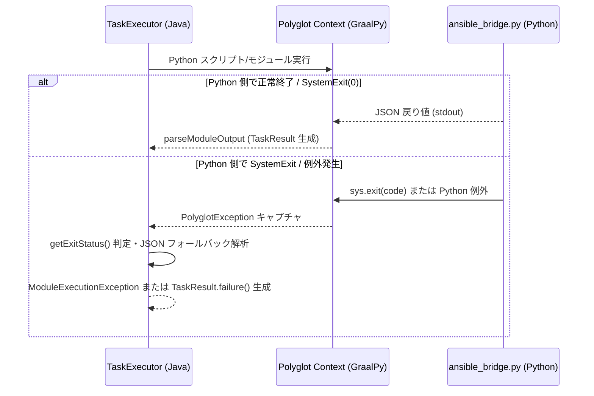

# エラーハンドリング方針 (Error Handling Policy & Specification)

本ドキュメントでは、`graal-ansible` におけるエラーハンドリングの基本方針、例外クラスの設計階層、GraalPy と Java 間のポリグロット例外伝播メカニズム、CLI 終了コードマッピング、エラー回復ライフサイクル、および例外発生時のリソースクリーンアップ仕様について詳細に定義します。

## 1. 基本方針

`graal-ansible` は、Ansible 本家との高い互換性と運用性を担保するため、以下の 3 つの基本原則に基づいてエラーハンドリングを行います。

- **実行継続性と制御フロー遵守**:
  Playbook 実行中にエラー（タスク失敗または到達不能）が発生した場合、該当ホストの実行制御フラグ（[`ignore_errors`](../implementation/Task-Control.md#8-委譲と実行制御-delegate_to-run_once-ignore_errors-ignore_unreachable-delegate_facts), [`ignore_unreachable`](../implementation/Task-Control.md#8-委譲と実行制御-delegate_to-run_once-ignore_errors-ignore_unreachable-delegate_facts), [`any_errors_fatal`](../implementation/Task-Control.md#16-致命的なエラーによる停止-any_errors_fatal), [`max_fail_percentage`](../implementation/Task-Control.md#19-失敗許容率-max_fail_percentage)）に従って正確に進行または停止を判断します。
- **構造化された原因特定とコンテキストの保持**:
  YAML 構文エラー、変数未定義エラー、接続エラー、モジュール実行失敗の各ケースにおいて、行番号、ホスト名、タスク名、および根本原因（Cause）を含む構造化されたエラー情報を保持・出力します。
- **多層例外設計と Native Image 最適化**:
  例外オブジェクトの生成およびキャプチャ時のオーバーヘッドを抑制し、GraalVM Native Image コンパイル環境においてもスタックトレースの欠損やリフレクション阻害が発生しない堅牢な例外処理構造を採用します。

## 2. 例外クラスの設計と階層構造 (Exception Class Hierarchy)

`graal-ansible` で使用される非チェック例外（`RuntimeException` 継承）の階層構造と各例外クラスの保持フィールドを以下に示します。

```
java.lang.RuntimeException
└── org.example.ansible.exception.AnsibleException (基底例外)
    ├── PlaybookParseException (YAML構文・スキーマ解析エラー)
    ├── VariableResolutionException (Jinja2テンプレート・変数未定義エラー)
    ├── UnreachableException (ターゲット接続不能・認証失敗・プロキシ遮断)
    ├── ModuleExecutionException (モジュールパラメータ不正・実行時異常)
    └── VaultException (Vault復号パスワード不一致・ファイル破損)
```

| 例外クラス | 主な発生条件 | 保持フィールド・詳細情報 |
| :--- | :--- | :--- |
| **`AnsibleException`** | `graal-ansible` エンジン全体の抽象基底例外クラス。 | `String message`, `Throwable cause` |
| **`PlaybookParseException`** | YAML の構文エラー、タグ解析失敗、必須フィールド欠落、スキーマ違反。 | `String filePath`, `int lineNumber`, `int columnNumber`, `String snippet` |
| **`VariableResolutionException`** | 未定義変数の参照（`strict_undefined` モード時）、Jinja2 フィルター引数不足、型変換失敗。 | `String variableName`, `String templateExpression`, `String hostName` |
| **`UnreachableException`** | SSH/WinRM/Docker 接続タイムアウト、認証エラー (HTTP 401 / Auth Failed)、ポートフォワードバインド拒否。 | `String hostName`, `String targetAddress`, `int port`, `String stage` (e.g. `[Bastion]`, `[Target]`) |
| **`ModuleExecutionException`** | モジュール引数 (`argument_spec`) の検証違反、コマンド非ゼロ終了コード (未許容時)、標準エラー出力異常。 | `String hostName`, `String taskName`, `String moduleName`, `int exitCode`, `Map<String, Object> resultData` |
| **`VaultException`** | `--vault-password-file` / `--vault-id` で指定されたパスワード不一致、ヘッダー `$ANSIBLE_VAULT;1.1` 破損。 | `String vaultId`, `String sourcePath` |

## 3. GraalPy / Java 相互運用における例外伝播 (Polyglot Exception Propagation)

管理ノード上で動作する GraalPy ランタイム（Python 実行環境）と Java コアエンジン間での例外キャプチャおよびデータ変換仕様です。



### 3.1 Python 例外のキャプチャと変換規則
- **`SystemExit` の捕捉**:
  Ansible モジュールや Action Plugin が `sys.exit(code)` を呼び出した場合、GraalPy は `org.graalvm.polyglot.PolyglotException` を発生させます。Java エンジンは `e.isExit()` を判定し、終了コード (`e.getExitStatus()`) が `0` の場合は標準出力（`stdout`）からの JSON 解析へ遷移します。非ゼロの場合は `ModuleExecutionException` へ変換します。
- **`PolyglotException` からの標準出力 / エラー抽出**:
  Python 側で例外（`FileNotFoundError`, `KeyError`, `AnsibleError` 等）が補足されず送出された場合、`ansible_bridge.py` のカスタム例外ハンドラが捕捉し、`{"failed": true, "msg": "...", "exception": "..."}` 形式の JSON を標準出力に書き出します。
- **Java 側ヘルパーによる Python レベル例外の送出**:
  `PythonOSMock.java` 等の Java ブリッジにおいてファイル不在が検知された場合、Python コンテキストへ直接 `FileNotFoundError` を発生させるため、Python 側の `_raise_file_not_found` ヘルパー関数をインターセプト呼び出しします。

### 3.2 モジュール戻り値 JSON からの `TaskResult` マッピング
`parseModuleOutput` メソッドは、Python 側の出力（JSON）を以下の基準で `TaskResult` へマッピングします。

1. **`failed` フィールド**: JSON 内の `failed` キーが `true` または `Truthiness.isTrue` で真と判定された場合、タスク結果を失敗（`success=false`）と判定します。
2. **`unreachable` フィールド**: JSON 内に `unreachable: true` が含まれる場合、タスク結果を到達不能（`unreachable=true`）としてマーキングし、`UnreachableException` コンテキストと同等に処理します。
3. **`rc` / `stdout` / `stderr` / `msg`**: コマンド実行結果データを保持し、`register` 変数やエラーログ出力へ直接伝播させます。

## 4. CLI 終了コードマッピング (CLI Exit Code Mapping)

`PlaybookCli` において、例外および `ExecutionReport` の集計結果に基づき判定・返却されるコマンドライン終了コードの確定マッピング仕様です。

| 終了コード | 分類 | 判定基準・対象例外 |
| :---: | :--- | :--- |
| **`0`** | 正常終了 (Success) | 全ホストの全タスクが正常終了（`failed` および `unreachable` がともに `0`）。 |
| **`1`** | 一般実行エラー (Runtime Error) | `VaultException`（パスワード不一致）、未捕捉の `AnsibleException`、I/O 障害、または Java 実行時例外。 |
| **`2`** | ターゲット実行失敗 (Host Failure / Unreachable) | `ExecutionReport.hasFailed()` または `ExecutionReport.hasUnreachable()` が真（`ignore_errors` 未適用タスクの失敗）。 |
| **`4`** | 構文・パースエラー (YAML / Syntax Error) | `PlaybookParseException` による Playbook 解析失敗、または未知のタスクキーワード検知。 |

### 4.1 `PlaybookCli` における判定フロー

```java
try {
    ExecutionReport report = executor.executeAndReport(playbookPath, options);
    if (report.hasFailed() || report.hasUnreachable()) {
        System.exit(2);
    } else {
        System.exit(0);
    }
} catch (PlaybookParseException e) {
    logger.severe("Syntax Error: " + e.getMessage());
    System.exit(4);
} catch (AnsibleException e) {
    logger.severe("Runtime Error: " + e.getMessage());
    System.exit(1);
}
```

## 5. エラー回復とライフサイクル制御 (Error Recovery Lifecycle)

エラー発生時におけるタスク制御・変数スコープへの自動データ注入と復旧動作の設計仕様です。

### 5.1 ブロック例外処理 (`block` / `rescue` / `always`) における自動変数注入
`block` 内のタスクで例外または失敗（`failed=true`）が検知された場合、`TaskQueueManager` は直ちに以下の 2 つの特殊変数を該当ホストの変数スコープへ自動注入して `rescue` セクションへ遷移します。

- **`ansible_failed_task`**: 失敗したタスクの定義情報（`name`, `action`, `args`, `location` 等を含む `Map<String, Object>`）。
- **`ansible_failed_result`**: 失敗したタスクの実行結果データ（`rc`, `stdout`, `stderr`, `msg`, `exception` 等を含む `Map<String, Object>`）。

`rescue` セクション内の全タスクが正常完了した場合、ブロック全体のステータスは **リカバリ完了（`failed=false`）** に上書き修正され、後続のタスクへ進行します。

### 5.2 エラー制御ディレクティブのカスケード優先度

複数ホスト・複数タスク実行時におけるエラー制御キーの評価順序は以下の通りです。

```
1. ignore_unreachable: true (Unreachable 例外を無視して進行)
   └── 2. ignore_errors: true (ModuleExecutionException / failed=true を無視して進行)
        └── 3. rescue ブロック存在有無 (rescue タスク実行によるステータスリカバリ)
             └── 4. any_errors_fatal: true (1ホストでも失敗時に全ホストのプレイ停止)
                  └── 5. max_fail_percentage (失敗率超過時にプレイ中断)
```

## 6. 例外発生時のリソースクリーンアップと安全性 (Resource Safety & Teardown)

例外発生時におけるリソースリーク（ファイル記述子、スレッド、一時ファイル）を確実に防ぐためのクローズ・解放仕様です。

- **SSH 多段トンネルの逆順クローズ (Cascading Close)**:
  `SshConnection` において例外が発生した場合、`try-finally` ブロックにて「ターゲットセッション (`targetSession`) -> 各踏み台のポートフォワード停止 (`stopLocalPortForwarding`) -> 各踏み台セッション (`bastionSession`)」の順序で確実にリソースを解放します。
- **並列実行エンジンのセマフォ・スレッド解放 (`FreeStrategy`)**:
  `FreeStrategy` および `TaskExecutor` でのタスク実行時、例外送出が発生した場合でも `finally` ブロックにおいて `Semaphore.release()` および `ThreadLocal`（コレクションパス、コンテキスト変数）の `remove()` を確実に実行します。
- **一時ファイルおよび非同期ジョブの安全な破棄**:
  Ansiballz モジュール転送時や `include_vars` スキャン時に生成された一時ファイルは、例外発生時であっても `Files.deleteIfExists` または `deleteOnExit` フックにより削除されます。`TaskExecutor.close()` 呼び出し時には、非同期スレッドプール (`AsyncJobManager`) のシャットダウンが行われます。

## 7. 関連ドキュメント

- [ロギング方針](Logging-Policy.md)：エラー発生時のログ出力詳細
- [タスク制御の実装詳細](../implementation/Task-Control.md)：`block/rescue/always`, `until/retries`, `ignore_errors` の詳細
- [CLI仕様](../features/CLI-Specification.md)：コマンドラインオプションと終了コードの仕様
- [Ansible Vault 復号仕様](../features/Vault-Support.md)：Vault 解読失敗時の例外ハンドリング
- [GraalPy 統合の詳細](GraalPy-Integration.md)：Polyglot API による Python 例外キャプチャ
